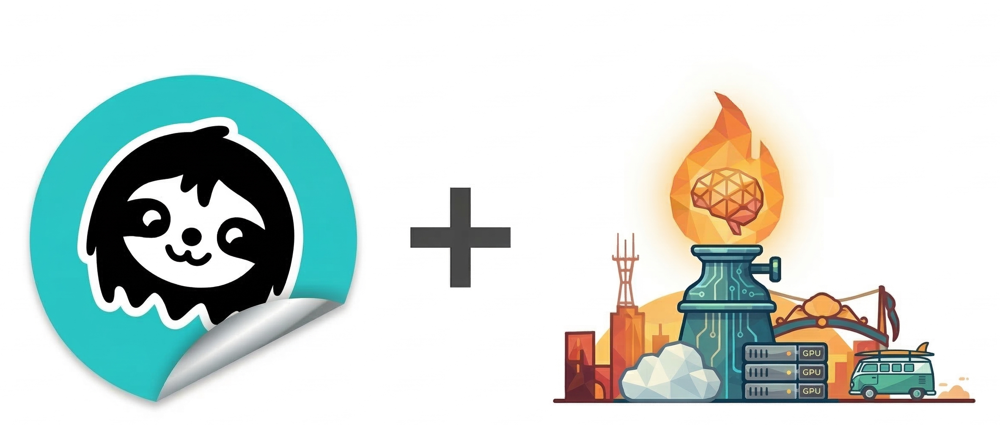

# unsloth-buddy

<p align="center"></p>

<p align="center">
  <a href="https://github.com/TYH-labs/unsloth-buddy"></a>
  <a href="LICENSE"></a>
  <a href="#快速开始"></a>
  <a href="https://gaslamp.dev/unsloth"></a>
  <a href="#openclaw"></a>
  <a href="#快速开始"></a>
  <a href="https://discord.gg/mZe4mbCQ6a"></a>
</p>

<p align="center"><code>/unsloth-buddy 我有 500 份医患问诊记录，想训练一个能自动摘要的模型，我只有一台 MacBook Air</code></p>

<p align="center">
  <a href="#快速开始"></a>
  <a href="demos/"></a>
  <a href="SKILL.md"></a>
</p>

<p align="center">
  <a href="https://www.bilibili.com/video/BV1VWAFzmECy/"></a>
  <a href="https://youtu.be/wG28uxDGjHE"></a>
</p>

<p align="center">
  <a href="README.md">English</a> | 简体中文 | <a href="README_zh-Hant.md">繁體中文</a>
</p>

---

## 这是什么？

一个像同事一样交流的微调 Agent。描述你的需求，它会提出合适的问题、找到或整理你的数据、选择合适的技术和模型、在你的硬件上训练、验证效果，并打包部署。

支持通过 [Unsloth](https://github.com/unslothai/unsloth) 在 NVIDIA GPU 上运行，也支持通过 [mlx-tune](https://github.com/ml-explore/mlx-lm) 在 Apple Silicon 上原生运行。隶属于 [Gaslamp](https://gaslamp.dev/) AI 开发平台 — [文档](https://gaslamp.dev/unsloth)。

---

## 一句话，一个微调模型。

```
你：在我的客户支持 FAQ 上微调一个小模型，我有一个 CSV 文件。

[第 0 阶段] 创建项目：customer_faq_sft_2026_03_17/
[第 1 阶段] 需求访谈...
           方法：SFT   模型：Qwen2.5-0.5B   部署：Ollama
[第 2 阶段] 数据策略...
           从 faq.csv 加载 1,200 行 → 重新格式化为对话消息
           保存到 data/train.jsonl（已验证：messages 列 ✓）
[第 3 阶段] 环境：Apple M4 24GB，mlx-tune 0.4.3，Python 3.12
           准备就绪，可以开始训练
[第 4 阶段] 训练... 200 步
           最终损失：1.42 → 已保存到 outputs/adapters/
[第 5 阶段] 评估（基础模型 vs 微调模型，贪心解码）：
           问：如何重置我的密码？
           [基础]  我可以帮您。是哪种密码？
           [微调]  前往登录页面 → 点击"忘记密码" → 查看邮件。
[第 6 阶段] 导出 → outputs/model-q4_k_m.gguf
           运行：ollama create my-faq-bot -f Modelfile && ollama run my-faq-bot
```

一次对话，七个阶段，最终得到一个可部署的模型。

---

## 快速开始

该技能包含子技能和工具脚本 — 请安装完整仓库，而非单个文件。

**Claude Code** *(推荐)*
```
/plugin marketplace add TYH-labs/unsloth-buddy
/plugin install unsloth-buddy@TYH-labs/unsloth-buddy
```
然后描述你想微调什么。技能会自动激活。

**Gemini CLI**
```bash
gemini extensions install https://github.com/TYH-labs/unsloth-buddy --consent
```

**任何支持 [Agent Skills](https://agentskills.io/) 标准的 Agent**
```bash
git clone https://github.com/TYH-labs/unsloth-buddy.git .agents/skills/unsloth-buddy
```

---

## 有何不同？

大多数工具假设你已经知道该怎么做，而这个工具不会。

| 你的顾虑 | 实际发生的事 |
|---|---|
| **"我不知道从哪里开始"** | 5 点访谈锁定方法、模型、数据、硬件和部署目标，然后再写任何代码 |
| **"我没有数据，或者格式不对"** | 专门的数据阶段负责获取、生成或重新格式化数据，精确匹配训练器所需的 schema |
| **"SFT？DPO？GRPO？选哪个？"** | 将你的目标映射到正确的技术，并用通俗语言解释原因 |
| **"选哪个模型？能装进我的 GPU 吗？"** | 检测你的硬件，映射到可用的模型大小，必要时估算云端成本 |
| **"Unsloth 在我的机器上安装不了"** | 两阶段环境检测捕获不匹配问题，并打印适合你环境的精确安装命令 |
| **"我训练好了，但它有效吗？"** | 将微调适配器与基础模型并排运行，让你看到差距，而不只是一个损失数值 |
| **"怎么部署？"** | 你指定目标（Ollama、vLLM、HF Hub）— 它运行转换命令 |

---

## 工作原理

七个阶段，每个阶段都限定在一个独立的带日期项目目录中，不会影响你的仓库根目录。

| 阶段 | 发生的事 | 产出文件 |
|---|---|---|
| **0. 初始化** | 创建 `{name}_{date}/` 标准目录结构 | `progress_log.md` |
| **1. 访谈** | 5 点 Unsloth 合同 — 方法、模型、数据、硬件、部署 | `project_brief.md` |
| **2. 数据** | 获取、验证并格式化为训练器 schema | `data_strategy.md` |
| **3. 环境** | 硬件扫描 → Python 环境检查 → 阻塞直到就绪 | `detect_env_result.json` |
| **4. 训练** | 生成并运行 `train.py`，流式输出到日志 | `outputs/adapters/` |
| **5. 评估** | 批量测试、交互式 REPL、基础模型对比微调模型 | `logs/eval.log` |
| **6. 导出** | GGUF、合并 16-bit 或 Hub 推送 | `outputs/` |

```
customer_faq_sft_2026_03_17/
├── train.py              eval.py
├── data/                 outputs/adapters/
├── logs/
├── project_brief.md      data_strategy.md
├── memory.md             progress_log.md
```

---

## 硬件支持

| 硬件 | 后端 | 能跑什么 |
|---|---|---|
| NVIDIA T4 (16 GB) | `unsloth` | 7B QLoRA，小规模 GRPO |
| NVIDIA A100 (80 GB) | `unsloth` | 70B QLoRA，14B LoRA 16-bit |
| Apple M1 / M2 / M3 / M4 | `mlx-tune` | 10 GB 统一内存跑 7B，24 GB 跑 13B |
| Google Colab (T4/L4/A100) | `unsloth` 通过 `colab-mcp` | 免费云端 GPU，可选接入 |

Unsloth 相比标准 HuggingFace 训练速度快约 2 倍，VRAM 使用量减少高达 80%，且使用精确梯度。

**支持的训练方法：** SFT、DPO、GRPO、ORPO、KTO、SimPO、视觉 SFT（Qwen2.5-VL、Llama 3.2 Vision、Gemma 3）

---

## 实时训练看板

每次本地训练都会自动在 **http://localhost:8080/** 打开实时看板：

- **SSE 流式传输** — 通过 `EventSource` 即时推送更新，无轮询延迟
- **EMA 平滑损失** — 清晰的趋势线覆盖嘈杂的原始损失，附带运行均值
- **动态阶段徽章** — 空闲 → 训练中 → 已完成 / 错误
- **ETA 与已用时间** — 根据步骤进度估算剩余时间
- **梯度范数** — 有数据时自动显示
- **评估指标** — 带动画空状态的评估损失/准确率
- **峰值 VRAM** — 追踪 GPU（CUDA）和 Apple MPS 内存用量

同时支持 NVIDIA（通过 `GaslampDashboardCallback`）和 Apple Silicon（通过 `MlxGaslampDashboard` 标准输出拦截器）。

---

## Google Colab 云端训练

Apple Silicon 用户如需更大的模型或 CUDA 专属功能，可将训练卸载到免费 Colab GPU：

1. 在 Claude Code 中安装 `colab-mcp`：
   ```bash
   uv python install 3.13
   claude mcp add colab-mcp -- uvx --from git+https://github.com/googlecolab/colab-mcp --python 3.13 colab-mcp
   ```
2. 打开 Colab 笔记本，连接到 T4/L4 GPU 运行时
3. Agent 自动连接、安装 Unsloth，在后台线程中开始训练，并每 30 秒轮询指标
4. 训练完成后从 Colab 文件浏览器下载适配器

本地 mlx-tune 仍是默认选项 — Colab 为需要更多算力时的可选方案。

---

## Gaslamp

`unsloth-buddy` 可独立使用，也可作为 [Gaslamp](https://gaslamp.dev/) 大型项目的一部分运行 — Gaslamp 是一个协调从研究到训练再到部署整个 ML 生命周期的 Agentic 平台。通过 Gaslamp 调用时，项目目录和状态在各个技能之间共享，结果会自动传递到下一阶段。

[gaslamp.dev/unsloth](https://gaslamp.dev/unsloth) — [gaslamp.dev](https://gaslamp.dev/)

---

## OpenClaw

**unsloth-buddy 是一个 [OpenClaw](https://github.com/openclaw/openclaw) 兼容技能。** 将仓库 URL 分享给 OpenClaw，描述你想微调的内容 — 它会读取 `AGENTS.md`，理解流程，并自动运行一切。

```
1. 将 https://github.com/TYH-labs/unsloth-buddy 分享给 OpenClaw
2. OpenClaw 读取 AGENTS.md → 理解 7 阶段微调生命周期
3. 说："在我的客户支持数据上微调一个模型"
4. 完成 — OpenClaw 运行访谈、格式化数据、训练、评估并导出
```

对于 Claude Code、Gemini CLI、Codex 或任何 ACP 兼容的 Agent：将 `AGENTS.md` 作为上下文提供，Agent 将自动引导相同的工作流程。

---

## 更新日志

- **2026-03-19** — 新增终端训练看板（`scripts/terminal_dashboard.py`）：在终端中实时显示 `plotext` 损失和学习率图表，支持 `--once` 模式供 Claude Code 一次性检查训练进度。
- **2026-03-18** — 新增通过 [colab-mcp](https://github.com/googlecolab/colab-mcp) 的 Google Colab 云端训练支持：可在 Claude Code 中直接使用免费 T4/L4/A100 GPU，支持后台线程训练、实时轮询进度及适配器下载流程。

---

## License

参见 `LICENSE.txt`。Unsloth 使用 MIT 许可证，mlx-tune 使用 MIT 许可证。
